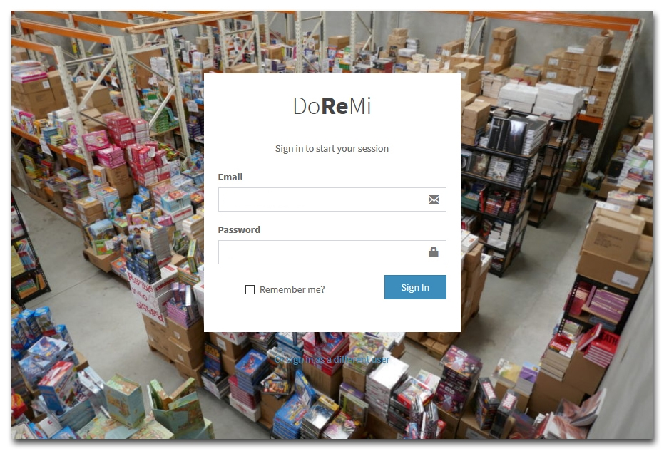
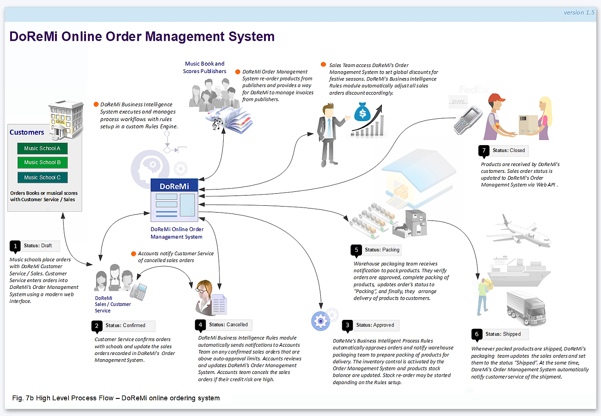
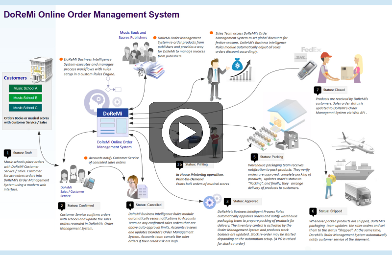

## SECTION 1 : DoReMi online Order Management system
(Includes Inventory Control and Management)

---
## SECTION 2 : EXECUTIVE SUMMARY / REPORT EXCERPT
DoReMi Books Inc. is a company started in 1955 and is in business for 57 years. They specialize in the supply and sale of classical music scores and music books in the USA with subsidiaries in the major cities of each of the 50 states. As a traditional industry, some of its business processes are manual and rather traditional. With the rapid development of the information technology (IT), especially the fast popularize and spread of Internet technology, the company is now facing strong competition from its competitors (both new and old), who have embraced online and internet sales as the new way of interacting and transacting with their customers.

In response to the new challenges brought on by online sales transactions, the company decided to conduct a business process improvement exercise to revamp their music books sale transaction and order handling process as well as introduce improved stock and inventory planning and management capabilities. This will include a new order handling process, an internet sales transaction system and an advanced business intelligence module for optimal stock inventory and warehousing forecasting.

Based on machine reasoning concepts and how logical rules and knowledge can be inferred with a reasoning based system, our group of five members, brainstormed and decided to build a system with hybrid architecture (NRules Engine and Web MVC technology) and automate, as much as we can, the business or functions based on the knowledge gleaned from: (a) feedback from the management board,  (b) current order handling processes and, (c) business issues encountered in current existing processes. 

We began by getting a good understanding of the overall key processes of the proposed solution by mapping them out with data acquisition modelling. Next, we determined the areas of improvements that we agreed should be implemented into the new business processes. We also made sure we analysed the processes with our improvements and see how these improvements were handled with test cases to validate our assumptions.

Our primary objective is to solve the business problems which are typically encountered in many traditional businesses which naturally includes DoReMi’s books ordering business processes.

---
## SECTION 3 : CREDITS / PROJECT CONTRIBUTION

| Official Full Name  | Student ID (MTech Applicable)  | Work Items (Who Did What) | Email (Optional) |
| :------------ |:---------------:| :-----| :-----|
| NG CHOON BENG CHAD | A0195327X | Project Management, Business process change consultant, Change Management| e0384958@u.nus.edu |
| SUN HANG | A0105742M | Technical Lead, Solution Design and Software development| e0384337@u.nus.edu |
| JIN XIN | A0066966L | Key development, principle developer, Rules coding | e0384232@u.nus.edu |
| XU DONGBIN | A0018636A | Machine Learning Analyst, Gather system requirements| e0384187@u.nus.edu |
| LI XIN | A0132084N | Machine Learning Analyst, Gather system requirements| e0384426@u.nus.edu |

---
## SECTION 4 : VIDEO OF SYSTEM MODELLING & USE CASE DEMO

---
## SECTION 5 : USER GUIDE

`<Github File Link>` : <https://github.com/chadng/MTech2019_Group_Project>

### Development Tools & Environment
- **Visual Studio 2017 (Community Edition)**. (https://visualstudio.microsoft.com/) 
- **Syncfusion JQuery Controls EJ1 (Community Edition)**. (https://www.syncfusion.com/products/communitylicense)

### Running Locally
* Download Visual Studio 2017 and install .Net development
* Clone this repo
* Open doremi.sln and make sure you have selected doremi
* click IIS Express
* 

### Live Version
Project is also released in azure: https://doremiwebapp.azurewebsites.net

### Credit
[Inventory order management system by go2ismail](https://github.com/go2ismail/Asp.Net-Core-Inventory-Order-Management-System)

---
## SECTION 6 : PROJECT REPORT / PAPER

`<Github File Link>` : <https://github.com/chadng/MTech2019_Group_Project/blob/Readme/ProjectReport/Project_Report.pdf>

**Recommended Sections for Project Report / Paper:**
- EXECUTIVE SUMMARY
- PROBLEM DESCRIPTION
- KNOWLEDGE MODELING
- SOLUTION OUTLINE
- CONCLUSION & REFERENCES
- BIBLIOGRAPHY
- APPENDIX A: SAMPLE INPUT & SYSTEM OUTPUT
- APPENDIX B: USERS MANUAL
- APPENDIX C: TECHNICAL SPECIFICATIONS

---
## SECTION 7 : MISCELLANEOUS

### References / Useful Documentations
* [Tortoise SVN Guide.pdf](https://tinyurl.com/y667ucum/Tortoise%20SVN%20Guide.pdf "Tortoise SVN Guide.pdf")
* [DoReMi Books Product.xlsx](https://tinyurl.com/y667ucum/DoReMi%20Books%20Product.xlsx "DoReMi Books Product.xlsx")
* [DoReMi Online Order Mgt Process Flow v1.6.pdf](https://tinyurl.com/y667ucum/DoReMi%20Online%20Order%20Mgt%20Process%20Flow%20v1.6.pdf "DoReMi Online Order Mgt Process Flow v1.6.pdf")
* [DoReMe Books Process Flow v2.5.pdf](https://tinyurl.com/y667ucum/DoReMe%20Books%20Process%20Flow%20v2.5.pdf "DoReMe Books Process Flow v2.5.pdf")
* [Sales Order Transaction Process Flow Chart_v2.0.pdf](https://tinyurl.com/y667ucum/Sales_Order_Transaction_Process_Flow_Chart_v2.0.pdf "Sales Order Transaction Process Flow Chart_v2.0.pdf")
* [User Guide v1.3.pdf](https://tinyurl.com/y4dhyfhe/User%20Guide%20v1.3.pdf "User Guide v1.3.pdf")

* [NRules Source Code SnapShot](https://tinyurl.com/y5hwsomh/NRules_develop.zip "NRules Source Code SnapShot")
---
* [Meetings and Conference Calls Recaps](https://tinyurl.com/y667ucum/Meetings "Meetings and Conference Calls Recaps")

---

[NUS-ISS](https://www.iss.nus.edu.sg "Institute of Systems Science, National University of Singapore")

**This [Machine Reasoning (MR)](https://www.iss.nus.edu.sg/executive-education/course/detail/machine-reasoning "Machine Reasoning") course is part of the Analytics and Intelligent Systems and Graduate Certificate in [Intelligent Reasoning Systems (IRS)](https://www.iss.nus.edu.sg/stackable-certificate-programmes/intelligent-systems "Intelligent Reasoning Systems") series offered by [NUS-ISS](https://www.iss.nus.edu.sg "Institute of Systems Science, National University of Singapore").**

**Lecturer: [GU Zhan (Sam)](https://www.iss.nus.edu.sg/about-us/staff/detail/201/GU%20Zhan "GU Zhan (Sam)")**

**zhan.gu@nus.edu.sg**
