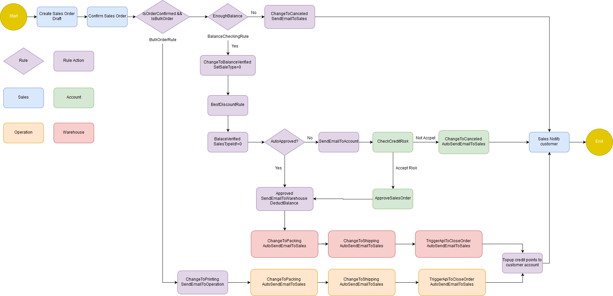
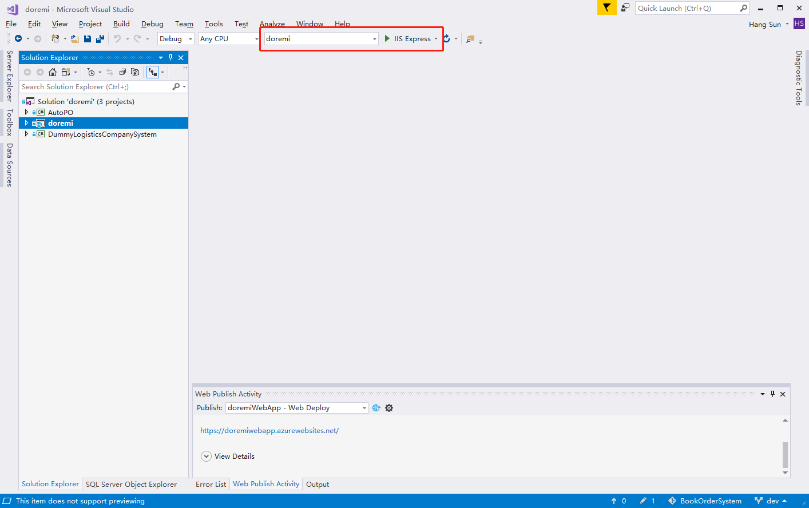

# DoReMi Music Book Order System

## Project members of Institute of Systems Science, National University of Singapore:
* Chad
* Jin Xin
* Li Xin
* Dong Bin
* Sun hang

## REPORT.pdf contains:
* Main report
* Annex A - scenarios of our system
* Annex B - User manual
* Annex C - video

DoReMi Books is a company that specializes in the supply and sale of classical music scores and music books in the USA with subsidiaries in the major cities of each of the 50 states. An important line of business for the company is the supply of music books to music schools. 

This system handles internal order process

## Development Tools & Environment
### Tools
- **Visual Studio 2017 (Community Edition)**. (https://visualstudio.microsoft.com/) 
- **Syncfusion JQuery Controls EJ1 (Community Edition)**. (https://www.syncfusion.com/products/communitylicense)

### Running Locally
* Download Visual Studio 2017 and install .Net development
* Clone this repo
* Open doremi.sln and make sure you have selected doremi
* click IIS Express
* 

### Live Version
Project is also released in azure: https://doremiwebapp.azurewebsites.net

## Credit
[Inventory order management system by go2ismail](https://github.com/go2ismail/Asp.Net-Core-Inventory-Order-Management-System)
